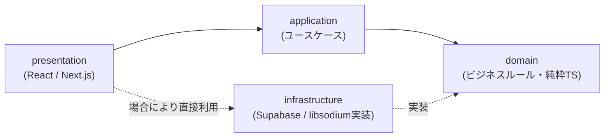

# Phase 2（後半）: アーキテクチャ設計

**フェーズステータス**: 提案（ユーザー承認待ち）
**前提**: Phase 2前半（技術選定）で確定したNext.js + Supabase構成を踏まえる

---

## 1. 採用するアーキテクチャ方針

**「Feature First」を主軸とし、Clean Architectureからは"依存性のルール"のみを実用的に取り入れる。**

フルセットのClean Architecture・DDD戦術パターンは、本プロジェクトの規模（少人数開発・数十人規模のMVP）には過剰であると判断する。理由は以下の通りである。

- レイヤー数を増やすほど、1機能の変更が複数ファイルへの横断編集を要求するようになり、少人数開発では開発速度そのものを損なう
- Next.jsのApp Router / Server Actionsという枠組み自体が、ある程度「機能単位でまとまったコード配置」を前提にした設計思想を持っており、これと逆行する厳密なレイヤー分離は相性が悪い
- 現時点のドメイン（ユーザー・会話・メッセージ・鍵）は複雑な業務ルールを持たず、集約ルートや値オブジェクトといったDDD戦術パターンをフル導入する実益が乏しい

**捨てないもの**: 「ドメインロジック（ビジネスルール）はフレームワークに依存しない」という依存性のルールだけは維持する。これにより、将来Supabaseから別のバックエンドに置き換える必要が生じても、ドメイン層のコードには手を入れずに済む。これがClean Architectureの本質的な価値であり、ここだけは犠牲にしない。

---

## 2. レイヤー構成（機能内の4層）

各featureディレクトリの内部を、以下の4層に分ける。

| 層 | 役割 | 依存してよい対象 |
|---|---|---|
| domain | ビジネスルール・型定義。純粋なTypeScriptのみで書き、React/Next.js/Supabaseに一切依存しない | 何にも依存しない |
| application | ユースケース（「メッセージを送信する」等の処理の組み立て） | domainのみ |
| infrastructure | Supabase・libsodium等、外部サービスとの実際の接続実装 | domainのインターフェースを実装する（依存性逆転） |
| presentation | Reactコンポーネント、Next.jsのpage/route | application、domain |

**依存性逆転の具体例**: `domain`層に「メッセージを保存する」というインターフェース（`MessageRepository`）だけを定義し、実際にSupabaseへ書き込む処理は`infrastructure`層で実装する。こうすることで、`application`層のユースケースはSupabaseの存在を知らないまま書ける。将来Supabaseをやめる決断をしても、書き換えが必要なのは`infrastructure`層だけで済む。

---

## 3. Feature First によるトップレベル構成（概念設計）

具体的なフォルダ名・ファイル配置はPhase 6（開発環境構築）で確定するが、概念モデルとして以下の機能単位（フィーチャー）に分割する。

- **auth**: アカウント登録・ログイン・招待コードによる連絡先追加
- **messaging**: 1対1・グループチャットのメッセージ送受信、既読管理
- **crypto**: 鍵生成・暗号化・復号（E2EEの中核。他のfeatureから利用されるが、他のfeatureのロジックには依存しない独立性の高いモジュールとする）
- **notification**: プッシュ通知の購読・送信
- **profile**: ユーザープロフィール管理

feature間の直接的な依存は避け、共通で使う型やUIコンポーネントは`shared`という独立領域に置く。これによって、将来「オープンチャット機能を追加する」といった拡張時に、既存featureへの影響を局所化できる。

---

## 4. 主要ドメインモデル（概念設計）

DB設計（Phase 3）・API設計（Phase 4）の前提となる概念モデルを、この段階で整理しておく。

| モデル | 概要 |
|---|---|
| User | アカウント情報、E2EE用の公開鍵（Identity Key） |
| Conversation | 1対1またはグループの会話単位 |
| Message | 暗号化された本文（サーバーは中身を復号できない）、送信者、送信日時、既読状態 |
| KeyBundle | E2EE鍵交換に必要な公開鍵一式（Signal Protocolの「PreKey Bundle」概念の簡易版） |

これらは概念設計であり、正規化・テーブル定義そのものはPhase 3で行う。

---

## 5. E2EEのアーキテクチャ上の位置づけ

- `crypto` featureの`domain`層に、暗号化・復号のインターフェースを定義する
- `infrastructure`層で`libsodium-wrappers`を用いた実装を提供する
- **秘密鍵はサーバー（Supabase）に一切送信せず、ブラウザのIndexedDB等クライアントローカルにのみ保存する。** これはアーキテクチャ上、最も重要な制約であり、他のどのfeatureからもこの原則を破ってはならない
- この制約により生まれる副作用（同じユーザーが別のブラウザ・端末からログインすると、新しい鍵ペアが必要になり過去のメッセージが読めなくなる、いわゆる「マルチデバイス問題」）は、MVP段階では許容し、既知の制約として明記しておく。この問題への対処（デバイス間の鍵同期の仕組み）はSignal・WhatsAppでも複雑な設計を要する領域であり、将来機能とする

---

## 6. Phase 2（後半）まとめ

### 実施内容
- Clean Architecture・DDDのフル適用を見送り、「Feature First＋依存性のルールのみ採用」という軽量アーキテクチャ方針を確定した。
- feature内の4層構成（domain/application/infrastructure/presentation）と依存関係のルールを定義した。
- 主要ドメインモデル（User/Conversation/Message/KeyBundle）を概念レベルで整理した。
- E2EEの鍵管理をアーキテクチャレベルで固定し、秘密鍵をサーバーに送らない原則を明記した。

### 設計判断（率直な理由の再確認）
- フルDDDを見送った理由は、少人数開発における実装速度への悪影響を最優先で考慮したためである。「教科書的に正しいか」より「このチームで完成させられるか」を優先した。

### 残課題
- マルチデバイス問題（複数端末での鍵同期）は、MVPでは未対応と明記し、将来機能として記録する。

### 次のPhase（Phase 3: DB設計）で行うこと
- 本アーキテクチャ設計にもとづき、PostgreSQL（Supabase）上の具体的なテーブル設計・RLS（Row Level Security）ポリシー設計を行う。
