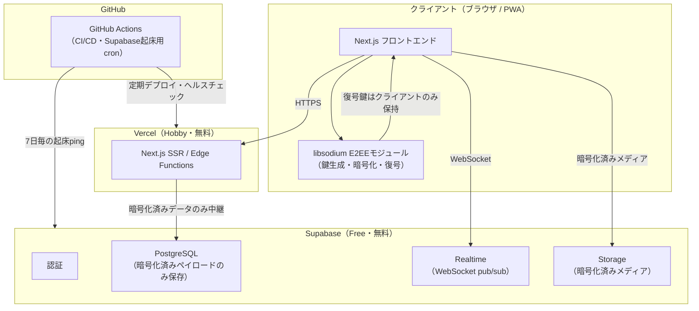

# Phase 2（前半）: 技術選定

**フェーズステータス**: 提案（ユーザー承認待ち）
**前提**: Phase 1で確定したMVP（家族・友人向け少人数E2EEチャット、数十人規模の検証運用、プライバシー軸の差別化、Web/PWA先行）を踏まえる

---

## 1. 選定方針

以下の優先順位で技術を選定した。

1. 無料で運用できること（数十人規模の検証運用の範囲内で課金が発生しないこと）
2. 長期運用・保守性・拡張性（オープンソースであること、特定ベンダーへの過度な依存を避けられること）
3. コミュニティの活発さ（ドキュメント・エコシステムの充実度）
4. GitHub Codespacesでの開発体験（Linux前提、コンテナ環境との親和性）

有料サービスは本ドキュメント内で候補にあがった場合、理由・料金・無料代替案を明記し、承認を得るまで採用しない。結論として、**MVPの技術スタックはすべて無料枠内に収まる**構成を提案する。有料化を検討すべき唯一の項目は独自ドメイン（10章）であり、これは任意である。

---

## 2. フロントエンド

| 項目 | 選定 | 理由 |
|---|---|---|
| フレームワーク | Next.js（App Router）+ React | TypeScriptとの親和性が高く、PWA化の実績も豊富。SSR/CSRを機能単位で使い分けられる |
| 言語 | TypeScript（strict mode） | 開発方針で明示された型安全の徹底に対応。`any`は`tsconfig.json`の`noImplicitAny: true`で禁止する |
| スタイリング | Tailwind CSS | ユーティリティファーストでデザインシステム構築（Phase 5）と相性が良く、無駄なCSSの肥大化を防げる |
| PWA対応 | `next-pwa` または Next.js標準のManifest/Service Worker機構 | ネイティブアプリ相当の体験（ホーム画面追加、オフライン時の簡易表示）を無料で実現する |
| 状態管理 | React標準（useState/useReducer）+ 必要に応じてZustand | Reduxのような重量級のライブラリは、MVPの規模には過剰と判断する |

---

## 3. ホスティング（フロントエンド）

**選定: Vercel（Hobbyプラン、無料）**

- 料金: $0
- 無料枠: 帯域幅100GB/月、ビルド時間6,000分/月、Serverless Function実行時間の上限あり
- 理由: Next.jsの開発元が提供するホスティングであり、ISR・Server Actions・Image Optimization等の最新機能が最初にサポートされる。GitHub連携により、Phase 6以降のCI/CDが自動化しやすい
- **重要な注意点**: Vercel Hobbyプランは規約上「個人の非商用プロジェクト」を対象としている。広告収益や有料機能を持つ場合はProプラン（$20/月）への移行が必要になる。本プロジェクトは家族・友人向けの非商用MVPであるため、現時点ではHobbyプランの対象内と判断できるが、**将来的にマネタイズを検討する段階になれば、この制約を必ず再確認する必要がある**（Phase 1の残課題として記録済みの「広告なし＝収益源なし」問題と直結する）
- 無料代替案: Cloudflare Pages（帯域無制限・商用利用可能だが、Next.jsの先端機能のサポートがVercelに比べて限定的）。将来、収益化やスケール拡大に伴いVercelのコストが問題になった場合の移行先として記録しておく

---

## 4. バックエンド・DB・認証・リアルタイム通信・ストレージ

**選定: Supabase（Freeプラン、無料）**

Supabaseは、PostgreSQLデータベース・認証・リアルタイム通信（WebSocketベースのpub/sub）・ファイルストレージを一つのプラットフォームで提供するオープンソースのBaaS（Backend as a Service）である。

| リソース | 無料枠の上限 |
|---|---|
| データベース容量 | 500MB |
| ファイルストレージ | 1GB |
| 月間アクティブユーザー | 50,000人 |
| Realtime同時接続数 | 200 |
| APIリクエスト数 | 無制限 |

**選定理由**
- 数十人規模の検証運用というPhase 1のスケール決定に対して、上記の無料枠は十分すぎる余裕がある
- リレーショナルDB（PostgreSQL）であるため、メッセージ・ユーザー・グループといった構造化データの整合性をSQLで担保しやすい（Phase 3のDB設計と直結）
- Row Level Security（RLS）というPostgreSQLの機能により、「このユーザーはこのメッセージ行を読めるか」をデータベースレベルで制御できる。これはE2EEと組み合わせた際の多層防御として有効
- オープンソースであるため、将来的にセルフホスト（自前サーバーへの移行）が可能。特定ベンダーへの過度な依存（ロックイン）を避けられる

**認識しておくべき制約（率直に指摘する）**
- **7日間アクセスがないとプロジェクトが自動的に一時停止される。** これは検証運用の初期段階で実際に起こりうる（家族・友人しか使っていない段階ではアクセス頻度が低いため）。対策として、GitHub Actionsで定期的にヘルスチェック用のAPIを呼び出す仕組みをPhase 6（開発環境構築）で組み込む
- **Realtime同時接続数200という上限は、一見余裕があるように見えるが、1人のユーザーが複数タブ・複数デバイスで接続すると想定より早く消費される。** 数十人規模なら実害はないと判断するが、Phase 3以降で接続数を監視する設計を入れておく
- データベース容量500MBを超えると自動的に読み取り専用モードに切り替わる（新規書き込み不可）。画像・動画は容量を圧迫しやすいため、メディアファイルは軽量化・圧縮処理を前提に設計する

**無料代替案**: Firebase（GoogleのBaaS）。NoSQL（Firestore）であり、E2EEチャットのようなリレーショナルな構造（誰が誰とどのグループに属するか）を表現するにはPostgreSQLの方が適していると判断し、今回は不採用とした。また、Firebaseは読み書き回数に応じた従量課金の性質が強く、コストの予測可能性という点でもSupabaseの定額制（無料枠超過までは完全無料）の方が個人開発に向いている。

---

## 5. E2EE（エンドツーエンド暗号化）の設計方針

これはMVPの差別化の核であり、同時に技術的難易度が最も高い部分である。率直に述べておくと、**Signal Protocolのフル実装をゼロから書くことは、個人〜少人数の開発体制では現実的ではない。** Signal Protocolは鍵交換（X3DH）・Double Ratchetアルゴリズム・グループ鍵管理を含む非常に複雑な仕様であり、専門のセキュリティ監査を経ずに独自実装することはむしろ危険である。

そのため、以下の段階的アプローチを提案する。

- **第一段階（MVP）**: `libsodium`（`libsodium-wrappers` npmパッケージ）を用いた、X25519による鍵交換とXChaCha20-Poly1305による認証付き暗号化を、1対1チャットに実装する。これは広く使われ監査実績もあるNaCl/libsodiumの標準的な暗号プリミティブであり、独自の暗号アルゴリズムを発明するリスクを避けられる
- **第二段階（将来機能）**: Forward Secrecy（鍵が漏洩しても過去のメッセージが読めない性質）とグループチャットへの拡張が必要になった段階で、`libsignal-client`（Signal公式のオープンソース実装）の導入を検討する

サーバー（Supabase）は暗号化されたペイロードのみを中継・保存し、復号鍵はクライアント側にのみ存在する設計とする。これはPhase 3（DB設計）・Phase 4（API設計）で具体的なテーブル構造・APIエンドポイント設計に落とし込む。

---

## 6. モノレポ構成・開発ツール

| 項目 | 選定 | 理由 |
|---|---|---|
| パッケージマネージャ | pnpm | npmよりディスク効率が良く、モノレポのworkspace機能も標準サポート。無料・OSS |
| モノレポ管理 | Turborepo | ビルドキャッシュにより開発体験（特にCodespaces上での再ビルド速度）が向上する。無料・OSS |
| Lint/Format | ESLint + Prettier | 開発方針で明示済み。TypeScript strictルールセットを適用する |
| テスト（ユニット） | Vitest | Next.js/Viteエコシステムとの親和性が高く、Jestより高速 |
| テスト（E2E） | Playwright | 無料・OSSで、実際のブラウザ操作をシミュレートしたテストが可能。Phase 7以降のテストフェーズで活用 |

---

## 7. CI/CD

**選定: GitHub Actions（無料枠）**

- プライベートリポジトリでも月2,000分の無料実行時間があり、パブリックリポジトリであれば無制限
- Phase 0〜6の各Phase終了時に必須とされている`git add / commit / push`のワークフローと自然に統合できる
- Lint・型チェック・テストの自動実行、Vercel/Supabaseへの自動デプロイをここに集約する

---

## 8. プッシュ通知

**選定: Web Push API（ブラウザ標準、VAPID方式）**

- 料金: $0（ブラウザ標準機能であり、外部の通知配信サービスを使わない）
- 理由: FCM（Firebase Cloud Messaging）等の外部サービスに依存せず、ブラウザ標準のPush APIとVAPID鍵ペアだけで実現できる。プライバシー軸の差別化（外部サービスへの依存を最小化する）とも整合する
- 制約: 通知本文に機微な情報を含めない設計とする（プッシュ通知サーバーを経由する以上、内容を最小限にするのがプライバシー上望ましい）

---

## 9. 技術選定まとめ表

| レイヤー | 技術 | 料金 |
|---|---|---|
| フロントエンド | Next.js + TypeScript + Tailwind CSS | 無料（OSS） |
| ホスティング（フロント） | Vercel Hobby | 無料 |
| バックエンド/DB/認証/Realtime/Storage | Supabase Free | 無料 |
| E2EE | libsodium-wrappers | 無料（OSS） |
| モノレポ | pnpm + Turborepo | 無料（OSS） |
| CI/CD | GitHub Actions | 無料枠内 |
| プッシュ通知 | Web Push API | 無料（標準API） |

**結論: MVPの技術スタックは月額$0で運用可能である。**

---

## 10. 有料サービスの検討事項（承認が必要な項目）

現時点でMVPに必須ではないが、将来的に検討候補となる有料サービスを事前に提示する。

| 項目 | 料金目安 | 無料代替案 | 承認状況 |
|---|---|---|---|
| 独自ドメイン | 年間1,000〜2,000円程度 | Vercelの無料サブドメイン（`xxxx.vercel.app`） | **未承認・現時点では不要と判断** |

MVPの検証段階では、Vercelの無料サブドメインで十分に機能する。独自ドメインが必要になるのは一般公開の段階以降であり、Phase 1で決定した「MVPでは対象外」の範囲を超える。したがって、本Phaseでは採用しない。

---

## 11. 全体構成図（概略）

**設計上の要点**: サーバー（Supabase）が保持するのは常に暗号化された状態のデータのみであり、復号に必要な鍵はクライアント（ブラウザ）側にのみ存在する。これにより、サーバー運営者（自分自身を含む）もメッセージ内容を読めない構成とする。これがプライバシー軸の差別化を技術的に裏付ける中核である。

---

## Phase 2（前半）まとめ

### 実施内容
- フロントエンド・ホスティング・バックエンド・E2EE・開発ツール・CI/CDの技術選定を行い、すべて無料で運用可能な構成を確定した。
- Supabase・Vercelの無料枠の制約（7日間停止、Realtime接続数上限、商用利用規約）を明示し、対策方針を示した。
- E2EE実装について、Signal Protocolのフル実装を避け、libsodiumによる段階的アプローチを提案した。

### 設計判断
- BaaS（Supabase）を採用し、自前でのサーバー構築・運用コストを最小化する。
- サーバーは暗号化済みデータの中継・保存のみを行い、復号鍵はクライアント側にのみ置く設計を前提とする。

### 残課題
- 独自ドメインは未承認のまま。一般公開段階で再検討する。
- Supabase無料枠の7日間停止対策（GitHub Actionsでのping）は、Phase 6（開発環境構築）で具体的に実装する。

### 次に行うこと
- 本技術選定についてご承認をいただき次第、Phase 2後半（Clean Architecture/Feature Firstに基づくレイヤー構成・依存関係設計）に進む。
