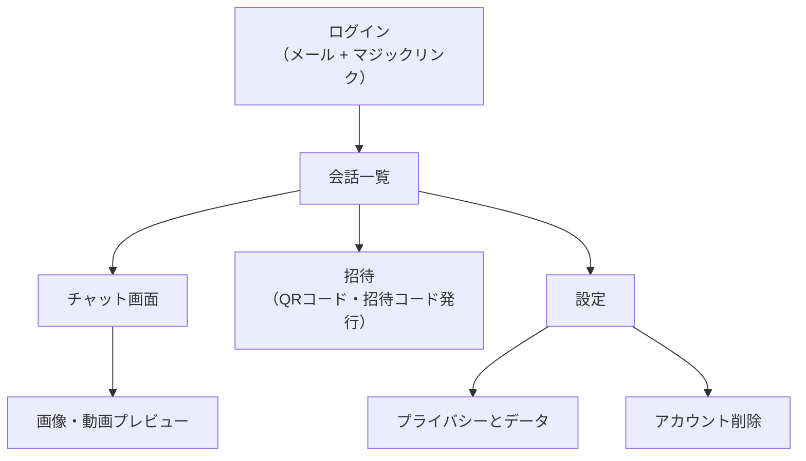

# Phase 5: UI/UX設計

**フェーズステータス**: 提案（ユーザー承認待ち）
**方針**: このPhaseは意図的に圧縮している。詳細なコンポーネントライブラリの仕様書は作らず、実装（Phase 7）に踏み出すために最低限必要な「画面遷移」「デザイントークン」「主要画面のワイヤーフレーム」のみを固める。

---

## 1. デザイン方針

差別化軸（プライバシー・広告なし）を、機能としてだけでなくUIの見た目そのものに埋め込む。具体的には以下を徹底する。

- 会話一覧の各項目には、メッセージ内容のプレビューを一切表示せず「新しいメッセージ」とだけ表示する（Phase 3・4で確定した「サーバーは平文を扱わない」原則と一致させる）
- チャット画面の上部に「エンドツーエンドで暗号化されています」を常時表示し、鍵アイコンで補強する
- 設定画面に「プライバシーとデータ」の項目を独立して設け、広告非表示・トラッキングなし・運営者もメッセージを読めないことを明文化する

装飾は最小限にし、Apple Human Interface GuidelinesおよびMaterial Designが共通して重視する「十分な余白」「明確なタップ領域」「一貫したアイコン言語」を踏襲する。

---

## 2. デザイントークン（最小限）

| カテゴリ | 値 | 備考 |
|---|---|---|
| 基本カラー | ニュートラルなグレー基調 | 派手な配色を避け、信頼感を優先する |
| アクセントカラー | 青系統1色のみ | 送信メッセージ・主要ボタンに限定して使用する |
| 成功・確認色 | 緑系統 | プライバシー項目のチェックマークなど、肯定的な意味を持つ箇所限定 |
| フォント | システムフォント（日本語: Noto Sans JP等） | Webフォントの追加読み込みコストを避け、起動速度を優先する（Phase 1の「軽量・高速」という価値観の反映） |
| 間隔 | 8pxグリッド | 4/8/12/16/24pxの範囲で統一する |
| 角丸 | カード12px、ボタン・バブル14〜18px | LINE的な親しみやすさとSignal的な簡潔さの中間を狙う |
| ダークモード | 必須対応 | 全トークンをダーク/ライト両対応で定義する |

具体的なカラーコード・コンポーネント単位の詳細仕様は、Phase 7（実装）の中でTailwind CSSの設定ファイルに落とし込みながら決定する。ここで確定させすぎると、実装時の試行錯誤の余地を奪い、かえって手戻りを生む。

---

## 3. 画面遷移図

画面数を意図的に絞っている。Phase 1で対象外とした学校・部活・オープンチャット向けのUI（ロール管理、モデレーション画面等）はこの遷移図に含まれていない。

---

## 4. 主要画面ワイヤーフレーム

会話一覧・チャット・招待・プライバシー設定の4画面を作成し、上記のVisualizerで提示済みである。実装時（Phase 7）はこのワイヤーフレームを直接の参照元とする。

---

## 5. Phase 5 まとめ

### 実施内容
- 4つの主要画面（会話一覧、チャット、招待、プライバシー設定）のワイヤーフレームを作成した。
- デザイントークンを最小限（カラー・フォント・間隔・角丸）に絞って定義した。
- 画面遷移図を確定し、Phase 1で対象外とした機能（学校・部活・オープンチャット向けUI）を含めないことを明示した。

### 設計判断（率直な理由の再確認）
- 詳細なコンポーネントライブラリの設計書作成を意図的に省略した。理由は、これ以上設計工程を重ねることが「実装の先延ばし」になっていたと判断したためである。

### 残課題
- 具体的なカラーコード・コンポーネント単位の仕様は、Phase 7の実装中にTailwind CSSの設定として決定する。

### 次のPhase（Phase 6: ディレクトリ構成・開発環境構築）で行うこと
- モノレポのディレクトリ構成を確定し、Codespaces上で実行可能な環境構築スクリプトを提供する。
